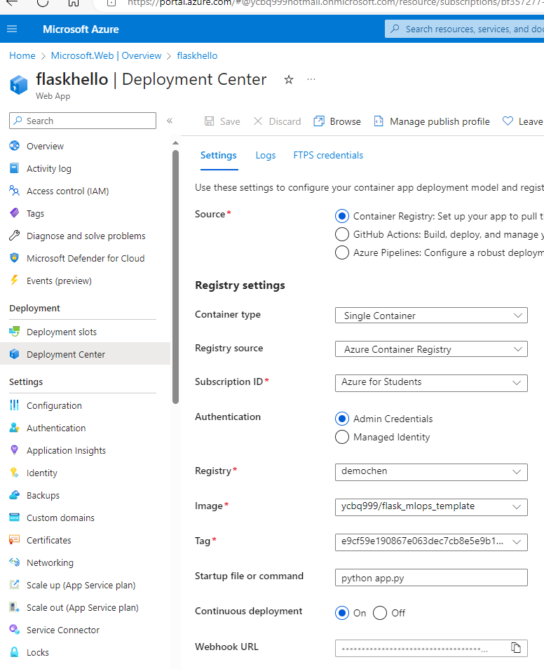

# Flask_MLOPs_Template

An end to end flask app deployment to azure app service using container registry

### First run it locally

make install
python app.py

this will run a simple flask app on your local github codespace

### Build docker image

Carefully select command to build image and run container from rundocker.sh file. You can run the bash file as a whole

check if the container work on your github local workspace

### github action build workflow

create azure container registry. add user name and password to your github repository

Select auzre app service template for workflow (yaml) file

you need to configure it manually so it match your azure account(container registry password and account name). 

### deploy it to your azure registry by triger the action from github

after successfully build workflow, you will see the image from your azure container registry. right click the image and you can deploy it to app service

after configuring app service, for this application you need to put command line python app.py on Deployment Center as the picture shows

